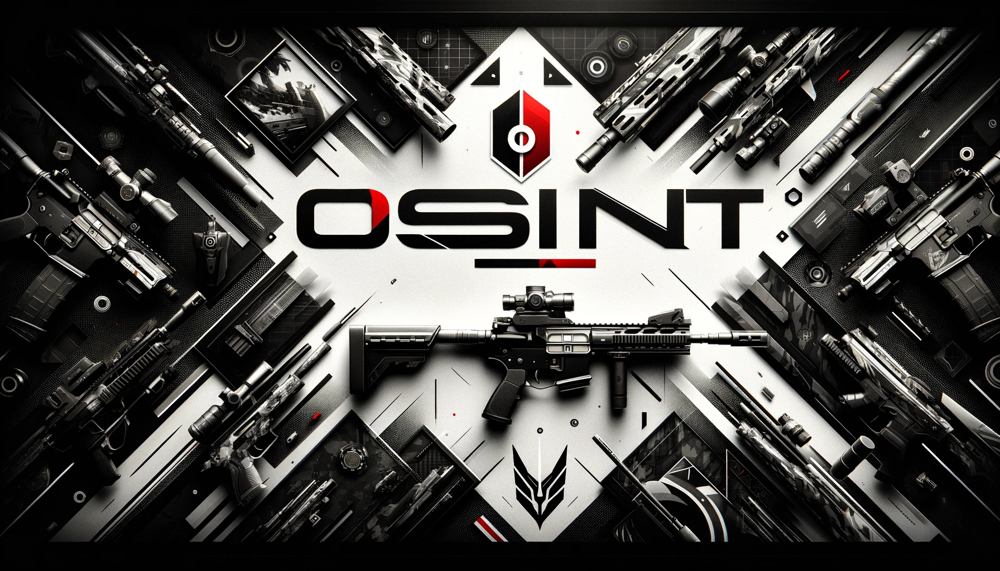

[ 🕷️
## Who Am I 👤 

    
Working in the field of cyber intelligence, my areas of focus include Advanced Persistent Threats (APT) Analysis, Cyber Geopolitics, 
Cyber Threat Profiling, Dark Web Monitoring, Information Warfare Strategies, Cyber Espionage Tactics, and Cyber Risk Assessment. 
My commitment lies in understanding and mitigating complex cyber threats, staying ahead in a constantly evolving security landscape. 
Passionate about the latest technological and security advancements, I am dedicated to addressing the dynamic challenges of cyber threats.    
  
<pre>
    🕵🏻‍♂️ OSINT • 🌍 GIS • 🌑 Darkweb • 🕷️ CTI 
    💻 Bash • 🐍 Python 
    🧠 Cyber Intelligence • 
    🔐 Information Security Analyst • 🚨 Incident Response • 🥷 Red Team • 🛡️ Penetration Test •  
</pre>
## MOTTO

    
  

   
  
