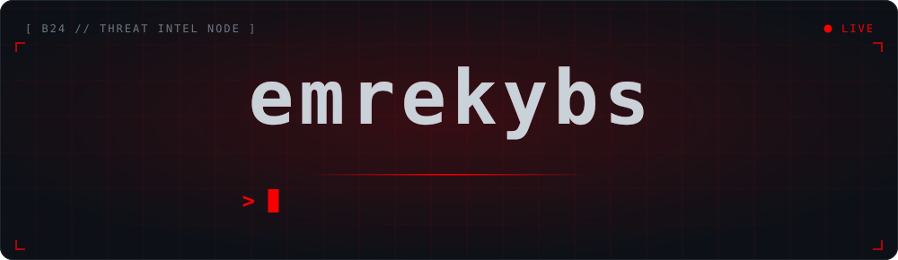
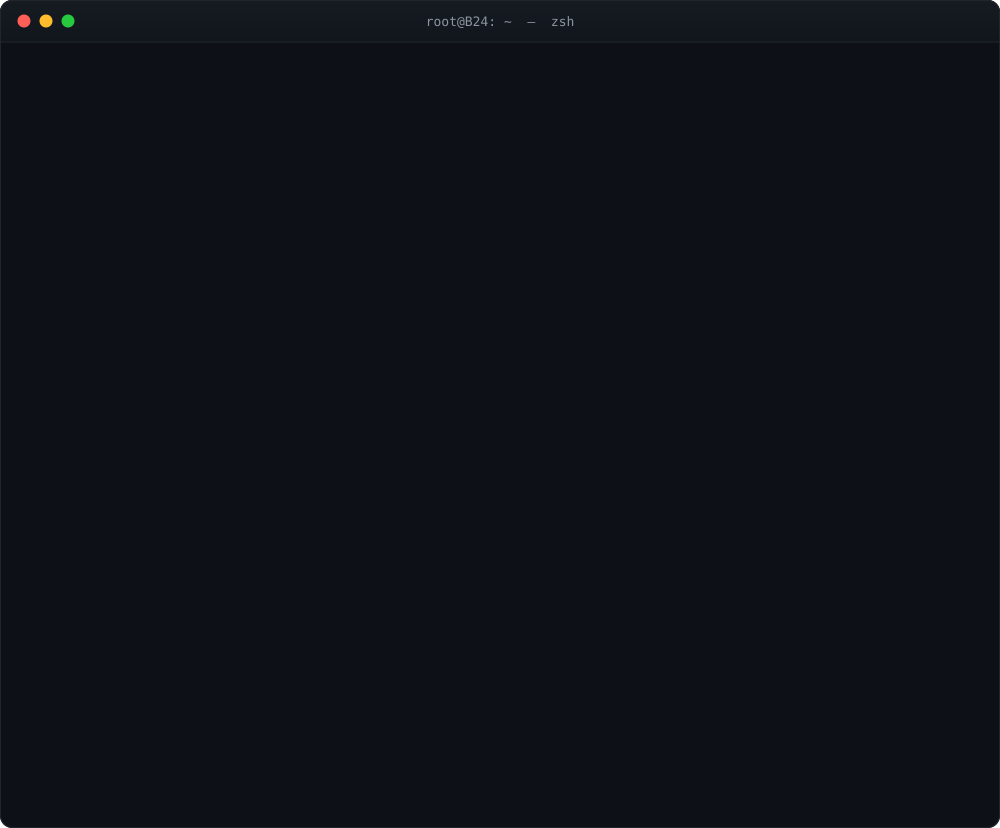
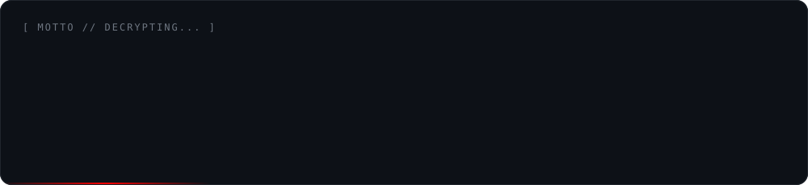

<div align="center">
  
</div>

<div align="center">
  <a href="https://github.com/emrekybs"></a>
  <a href="https://github.com/emrekybs?tab=followers"></a>
  <a href="https://github.com/emrekybs?tab=repositories"></a>
</div>


<div align="center">
  
</div>


### `$ ls ~/certs`

```text
CEH Master        CompTIA Security+
CRTO              CompTIA CySA+
CRTP              CompTIA PenTest+
eWPTX             CompTIA CASP+ / SecurityX
CAP               CompTIA Cloud+

total: 10 | status: ACTIVE | next: loading...
```

### `$ cat ops/status.log`

```diff
+ [ACTIVE]   Dark web actor tracking & underground monitoring
+ [ACTIVE]   APT TTP mapping → MITRE ATT&CK
+ [ACTIVE]   OSINT tooling / automation development
! [RESEARCH] Adversary emulation & AD exploitation chains
! [RESEARCH] Threat actor infrastructure pivoting
- [LEARNING] Malware analysis & reverse engineering
```


### `$ git log --stat`

<div align="center">
  
  <br><br>
  <picture>
    <source media="(prefers-color-scheme: dark)" srcset="https://raw.githubusercontent.com/emrekybs/emrekybs/output/snake-dark.svg"/>
    <source media="(prefers-color-scheme: light)" srcset="https://raw.githubusercontent.com/emrekybs/emrekybs/output/snake-light.svg"/>
  </picture>
</div>


<div align="center">
  
</div>

<br>

<div align="center">
  <a href="https://www.linkedin.com/in/emre-koybasi/"></a>
  <a href="https://x.com/emrekybs0"></a>
  <a href="https://www.instagram.com/emrekybs8/"></a>
  <a href="mailto:emrekoybasi@protonmail.com"></a>
</div>


<div align="center">
  <sub><code>connection closed by remote host.</code></sub>
</div>
